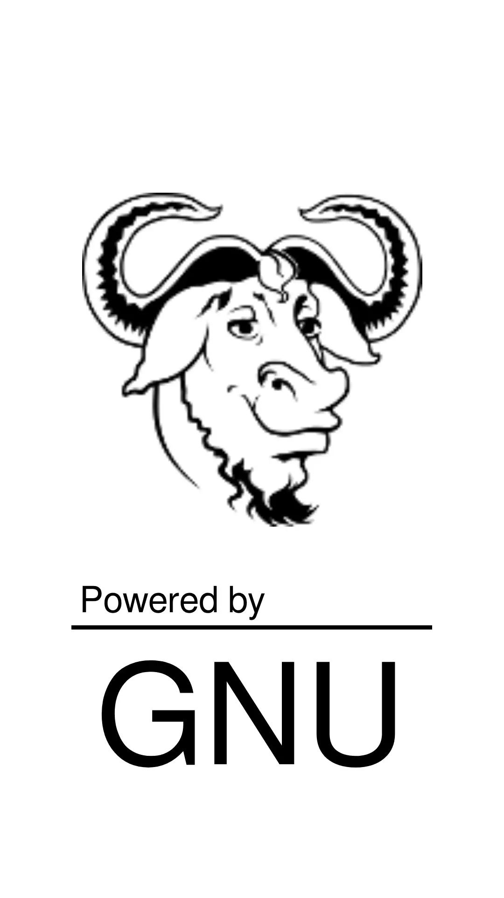
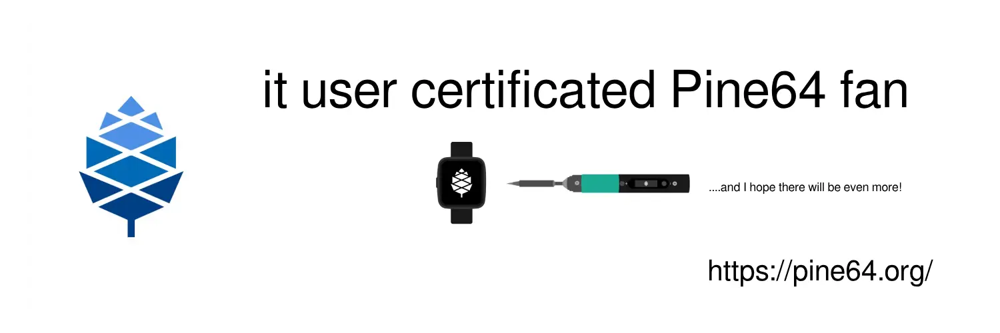

# Hello world!
I'm IoT and Backend developer
```golang
var Moclauq = dev{
  langs: "ru", "eng", "pl?"
  devLangs: "Golang", "C", "Js",
  devices: "Mi 9t Pro", "Logitech MX Ergo", "Pine64 PineWatch"
}
```
> "Programming is not a science. Programming is a craft."<br>
> © Richard Stollman

<table>
<tr>
<td align="center" valign="middle"></td>
<td align="center" valign="middle"></td>
</tr>
</table>

### Stats


